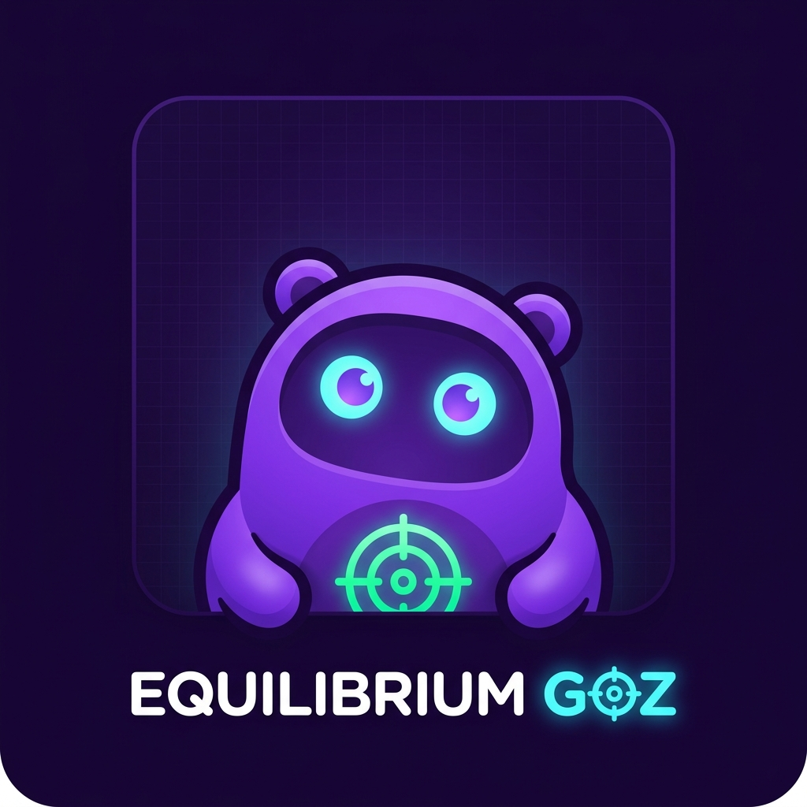

  

# Equilibrium GOZ — 4 Zones, GTD Inbox & Habit Mastery Engine for Obsidian

**Equilibrium GOZ** brings the power of **GetOutZone (GOZ)** directly into your Obsidian Vault. Track your personal evolution across the **4 Zones of Expansion**, capture GTD tasks instantly, manage habit streaks, and gain levels in a gamified RPG experience—all inside Obsidian!

---

## ✨ Key Features

- 🎯 **4 Expansion Zones Tracker**:
  - 🏠 **Confort** (`#6366F1`)
  - ⚡ **Miedo** (`#EF4444`)
  - 📚 **Aprendizaje** (`#F59E0B`)
  - 🚀 **Crecimiento** (`#10B981`)
- 🌱 **RPG Leveling System**: Ranks from Level 1 (*Novicio*) to Level 10 (*Trascendente*), XP progress tracking, and active daily streak multipliers (🔥).
- 📥 **GTD Quick Capture & Inbox**: Instant task capture with context tags (`@ordenador`, `@llamadas`, `@en_calle`, `@focus_modo`, `@casa`).
- 🌿 **Habit Mastery Engine**: Track Daily, Weekly, and Monthly habit streaks.
- 💾 **Data Independence & Backup**: Data is saved locally in `.obsidian/plugins/obsidian-equilibrium-goz/data.json`. Export & import JSON backups to keep data synced with the GOZ Desktop App.

---

## 🚀 Installation

### Option 1: Community Plugin Store (Recommended)
1. In Obsidian, go to **Settings > Community Plugins**.
2. Search for **Equilibrium GOZ**.
3. Click **Install** and then **Enable**.

### Option 2: Manual Installation
1. Download `main.js`, `manifest.json`, and `styles.css` from the latest Release.
2. Create a folder in your vault: `.obsidian/plugins/obsidian-equilibrium-goz/`.
3. Copy the 3 downloaded files into that folder.
4. Reload Obsidian and enable the plugin in **Settings > Community Plugins**.

---

## 🎯 Usage

- **Ribbon Icon**: Click the target icon (🎯) on the left sidebar to open the Equilibrium GOZ view.
- **Command Palette**: Press `Ctrl+P` (or `Cmd+P`) and search for `Equilibrium GOZ: Abrir Panel Equilibrium GOZ`.

---

## 📄 License

This project is licensed under the [MIT License](LICENSE).
Built by Nelxson2099 × Antigravity AI.
